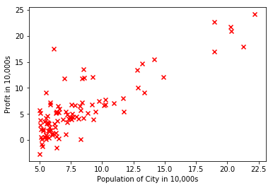
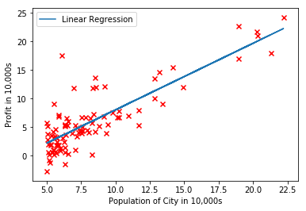
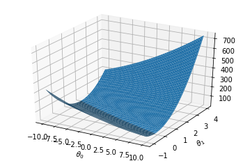
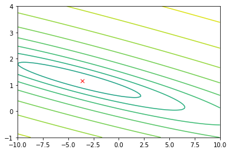

```python
import numpy as np
import matplotlib.pyplot as plt
```


```python
data = np.loadtxt('street&profits.txt', delimiter=',', usecols=(0, 1))
X = data[:, 0]
y = data[:, 1]
m = y.size
```


```python
def plot_data(x, y):
    plt.xlabel("Population of City in 10,000s")
    plt.ylabel("Profit in 10,000s")
    plt.scatter(x, y, c='red', marker='x')
    plt.show()
```


```python
plot_data(X, y)
```





```python
X = np.c_[np.ones(m), X]
theta = np.zeros(2)
iterations = 1500
alpha = 0.01
```


```python
def compute_cost(X, y, theta):
    m = y.size
    cost = 0
    for i in range(0, m):
        cost += (y[i] - theta[1] * X[i][1] - theta[0]) ** 2
    cost /= 2 * m
    return cost

print('Initial cost : ' + str(compute_cost(X, y, theta)) + ' (This value should be about 32.07)')
```

    Initial cost : 32.072733877455654 (This value should be about 32.07)
    


```python
def gradient_descent(X, y, theta, alpha, num_iters):
    m = y.size
    J_history = np.zeros(num_iters)

    for i in range(0, num_iters):
        
        b_grad = 0.0
        w_grad = 0.0
    
        for n in range(0, m):
            b_grad = b_grad - (y[n] - theta[0] - theta[1]*X[n][1])*1.0/m
            w_grad = w_grad - (y[n] - theta[0] - theta[1]*X[n][1])*X[n][1]/m
    
        theta[0] = theta[0] - alpha*b_grad
        theta[1] = theta[1] - alpha*w_grad

        J_history[i] = compute_cost(X, y, theta)

    return theta, J_history

theta, J_history = gradient_descent(X, y, theta, alpha, iterations)
```


```python
print('Theta found by gradient descent: ' + str(theta.reshape(2)))
```

    Theta found by gradient descent: [-3.63029144  1.16636235]
    


```python
plt.figure(0)
line1, = plt.plot(X[:, 1], np.dot(X, theta), label='Linear Regression')
plt.legend(handles=[line1])
plot_data(data[:,0], data[:,1])
```





```python
predict1 = np.dot(np.array([1, 3.5]), theta)
print('For population = 35,000, we predict a profit of {:0.3f} (This value should be about 4519.77)'.format(predict1*10000))
predict2 = np.dot(np.array([1, 7]), theta)
print('For population = 70,000, we predict a profit of {:0.3f} (This value should be about 45342.45)'.format(predict2*10000))
```

    For population = 35,000, we predict a profit of 4519.768 (This value should be about 4519.77)
    For population = 70,000, we predict a profit of 45342.450 (This value should be about 45342.45)
    


```python
from matplotlib.colors import LogNorm
from mpl_toolkits.mplot3d import axes3d, Axes3D

theta0_vals = np.linspace(-10, 10, 100)
theta1_vals = np.linspace(-1, 4, 100)

xs, ys = np.meshgrid(theta0_vals, theta1_vals)
J_vals = np.zeros(xs.shape)

# Fill out J_vals
for i in range(0, theta0_vals.size):
    for j in range(0, theta1_vals.size):
        t = np.array([theta0_vals[i], theta1_vals[j]])
        J_vals[i][j] = compute_cost(X, y, t)

J_vals = np.transpose(J_vals)

fig1 = plt.figure(1)
ax = fig1.gca(projection='3d')
ax.plot_surface(xs, ys, J_vals)
plt.xlabel(r'$\theta_0$')
plt.ylabel(r'$\theta_1$')
plt.show()

plt.figure(2)
lvls = np.logspace(-2, 3, 20)
plt.contour(xs, ys, J_vals, levels=lvls, norm=LogNorm())
plt.plot(theta[0], theta[1], c='r', marker="x")
plt.show()
```







